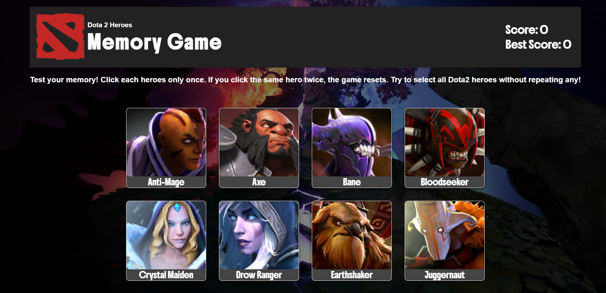
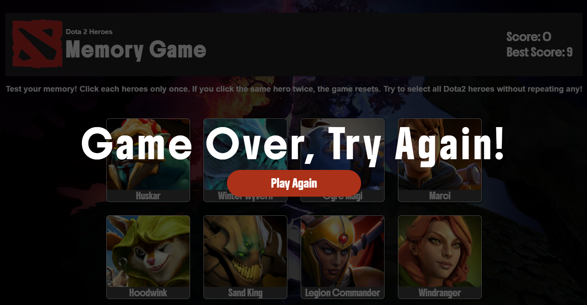

# 🧠 Dota 2 Memory Card Game

A memory card game built with **React** and **Vite**, featuring heroes from Dota 2.
Try to click as many different heroes as possible **without repeating** any!

---
### 🔹 Game Preview

### 🔹 Game Over Modal

---
## 🌐 Live Demo
👉 [Play it here!](https://xxemat20xx.github.io/Memory-card/)
---

## 🛠️ Tech Stack
- React + Vite
- OpenDota API
- GitHub Pages for deployment

🙌 Acknowledgments
[OpenDota API](https://docs.opendota.com)

Massive thanks to [The Odin Project](https://www.theodinproject.com/dashboard)
For providing an incredible curriculum and helping me learn React through project-based learning.

